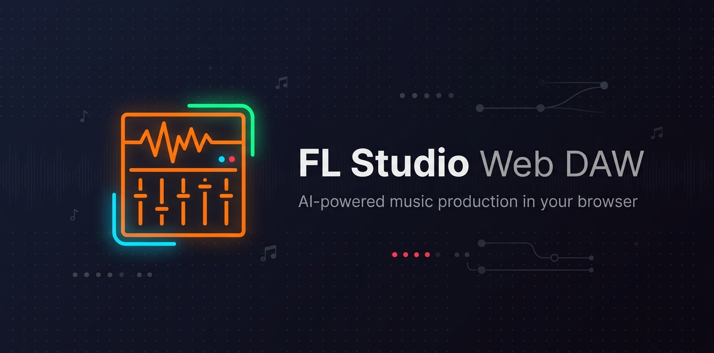
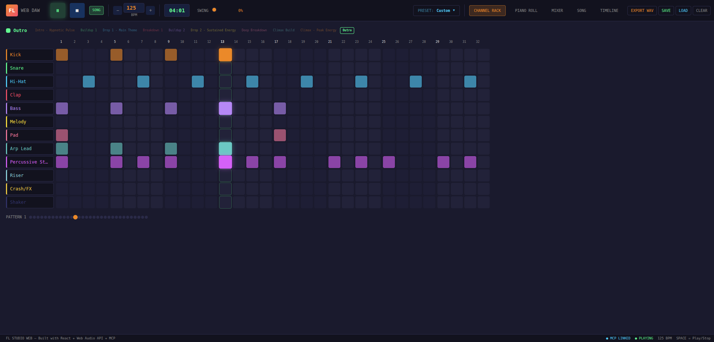
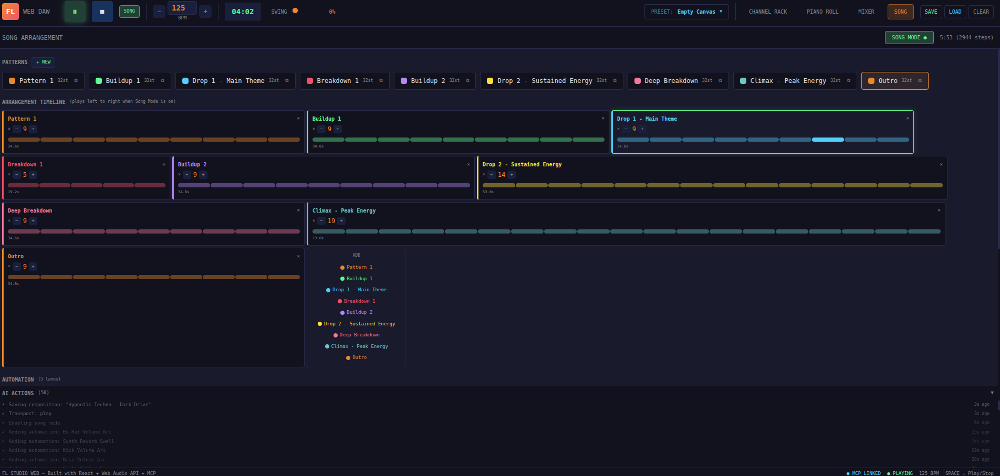
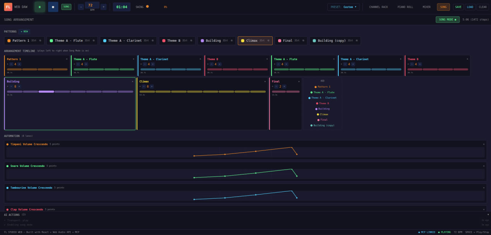
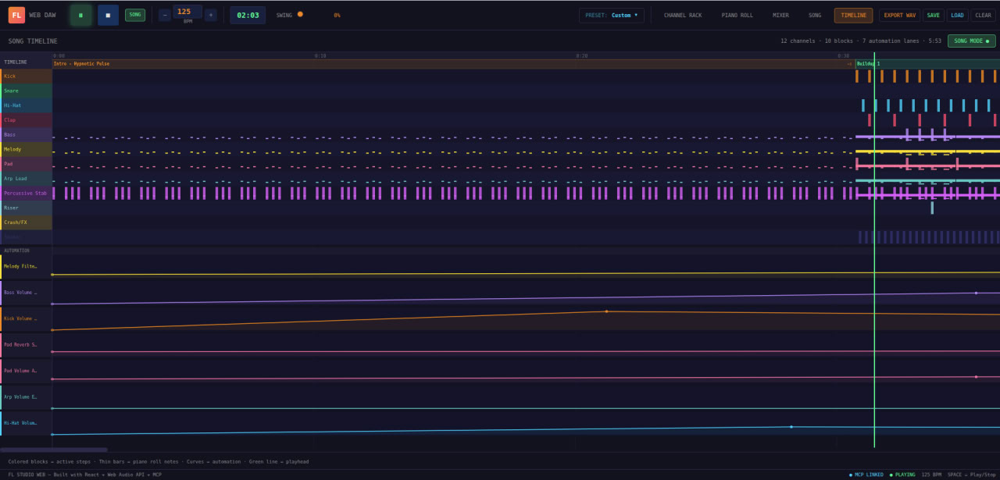

<p align="center">
  
</p>

<p align="center">
  <b>AI-powered music production in your browser</b>
</p>

<p align="center">
  
  
  
  
</p>

---

A web-based Digital Audio Workstation built with React, TypeScript, Vite, and Tailwind v4. Features real-time synthesized audio via the Web Audio API, and an MCP server that lets AI agents compose music programmatically.

Built entirely with [Claude Code](https://claude.ai/code) to demonstrate what's possible with AI-assisted development.

## Screenshots

### Channel Rack — Step Sequencer


### Song Arrangement — Pattern blocks with repeat counts


### Automation Lanes — Volume, filter, and reverb curves


### Timeline View — Unified overview of the entire composition


## Features

### Audio Engine
- 7 sound types: kick, snare, hi-hat, clap, bass, synth, noise (risers/sweeps)
- Full subtractive synthesis: waveform, filter cutoff/resonance/envelope, attack/decay, pitch sweep, distortion
- Per-channel delay and reverb effects
- Precise lookahead scheduler for sample-accurate timing

### DAW Interface
- **Channel Rack** — step sequencer with up to 16 dynamic channels
- **Piano Roll** — canvas-based note editor for melodic channels
- **Mixer** — volume faders, pan knobs, mute/solo, real-time VU meters
- **Song Arrangement** — multi-pattern system with repeat counts
- **Automation** — breakpoint-based parameter automation across the song timeline
- **Timeline** — unified view of all channels, patterns, and automation curves
- **Preset Library** — 7 genre presets (Trap, Lo-Fi, Techno, Future Bass, DnB, House, Synthwave)

### AI Integration (MCP)
- **MCP Server** — stdio server exposing 25+ tools for AI-driven composition
- **WebSocket Bridge** — real-time communication between AI agent and browser DAW
- **Producer Skill** — teaches Claude how to use the DAW tools, music theory, sound design recipes
- **Prompt Engineer Skill** — generates optimized production prompts from vague descriptions
- **Live Action Log** — real-time feed of AI actions in the browser UI
- **"AI COMPOSING" indicator** — pulsing status when the agent is actively working

### Export & Persistence
- **WAV Export** — offline rendering with chunked processing (no browser freezing)
- **Save/Load** — compositions saved to localStorage + downloadable `.flp.json` files
- **Full state preservation** — patterns, channels, synth params, arrangement, automation all serialized

## Tech Stack

- **Frontend**: React 19, TypeScript, Vite 8, Tailwind CSS v4
- **Audio**: Web Audio API (synthesis, effects, offline rendering)
- **State**: Custom external store with `useSyncExternalStore`
- **MCP**: `@modelcontextprotocol/sdk`, WebSocket bridge (`ws`), stdio transport
- **No external audio samples** — all sounds are synthesized from oscillators and noise

## Getting Started

```bash
# Install dependencies
npm install

# Start the DAW
npm run dev
```

Open http://localhost:5173 in your browser.

## AI-Powered Composition

To let an AI agent compose music in real-time:

```bash
# Terminal 1: Start the DAW
npm run dev

# Terminal 2: Start the WebSocket bridge
npm run bridge

# Terminal 3: Open a Claude Code session in this directory
claude
```

The `.mcp.json` auto-configures the MCP server. The bridge connects the AI to your browser. Then just ask Claude to make music:

> "Make me a dark melodic techno track at 130 BPM with an acid bassline and atmospheric pads"

The AI will use the MCP tools to build patterns, shape sounds, arrange the song, add automation, and play it — all visible in real-time in your browser.

## Try an Example Composition

An AI-composed track is included in the repo so you can hear the DAW in action immediately:

1. Start the DAW: `npm run dev`
2. Open http://localhost:5173
3. Click **LOAD** in the transport bar
4. Type `file` and select `examples/Hypnotic Techno - Dark Drive.flp.json`
5. Click the **SONG** button (next to stop) to enable song mode
6. Press **Play**

This is a 12-channel melodic techno track at 125 BPM with:
- 10 patterns (Intro, Buildup, Drop, Breakdown, Climax, Outro)
- Dedicated channels for kick, snare, hi-hat, clap, bass, melody, pad, arp, stab, riser, crash, and shaker
- 7 automation lanes controlling volume crescendos, filter sweeps, and reverb builds
- Full song arrangement playing through the complete structure

You can explore it in the **TIMELINE** tab to see all channels, patterns, and automation curves laid out across the full song, or switch to **CHANNEL RACK** to inspect individual pattern steps.

## Available Scripts

| Command | Description |
|---------|-------------|
| `npm run dev` | Start Vite dev server |
| `npm run build` | Type check + production build |
| `npm run bridge` | Start WebSocket bridge for MCP |
| `npm run mcp` | Start MCP server (usually auto-started) |

## MCP Tools

The MCP server exposes these tool categories:

| Category | Tools |
|----------|-------|
| **State** | `get_state`, `load_preset`, `clear_pattern` |
| **Tempo** | `set_bpm`, `set_swing`, `set_total_steps` |
| **Channels** | `add_channel`, `remove_channel`, `rename_channel` |
| **Sequencer** | `set_steps`, `toggle_step` |
| **Piano Roll** | `add_notes`, `clear_notes`, `set_piano_roll_channel` |
| **Sound Design** | `tweak_sound` (waveform, filter, envelope, effects, distortion) |
| **Mixer** | `set_channel_volume`, `set_channel_pan`, `toggle_mute`, `toggle_solo` |
| **Patterns** | `create_pattern`, `copy_pattern`, `switch_pattern`, `rename_pattern` |
| **Arrangement** | `set_arrangement`, `set_song_mode` |
| **Automation** | `add_automation`, `clear_automation` |
| **Transport** | `transport` (play/stop/toggle) |
| **Persistence** | `save_composition`, `load_composition`, `list_compositions`, `export_wav` |

## Claude Code Skills

Two custom skills are included in `.claude/skills/` to give Claude deep domain knowledge:

### `/fl-studio-producer`
Onboards Claude as a music producer. Teaches it the full DAW workflow, all MCP tools, music theory (scales, chords, MIDI pitch reference), sound design recipes (how to make acid bass, pads, risers, etc.), genre-specific patterns, transition techniques, and mixing tips. Triggers automatically when you ask Claude to create music.

### `/fl-studio-prompt-engineer`
Generates optimized, detailed production prompts from vague descriptions. If you say "make something like Daft Punk" or "chill beats to study to", this skill interviews you briefly then produces a comprehensive copy-pasteable prompt with channel allocation, sound design parameters, note sequences, arrangement structure, and automation curves.

## Architecture

```
Claude (AI Agent)
    ↓ MCP stdio
MCP Server (src/mcp/server.ts)
    ↓ WebSocket
Bridge Server (src/mcp/bridge.ts)
    ↓ WebSocket
DAW Browser Tab (React + Web Audio API)
```

## License

MIT
